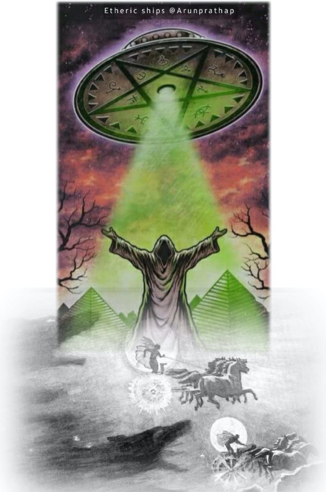

Symbolicznie, treści widywane przez uprowadzonych są identyczne do treści rytuałów inicjacyjnych lub podróżny astralnych, które są osadzone w tradycjach (okultystycznych) każdej kultury. (...) Struktura opowieści o uprowadzeniach jest identyczna z rytuałami inicjacyjnymi. (...) Współczesne byty UFO należą do tej samej klasy manifestacji co (okultysteczne) byty opisywane już wieki temu.

===

Whitley Strieber uważa, że dokładnie to jest powodem, dla którego UFO tutaj jest: "Uważam, że oni prawdopodobne prowadzą nas jak położne w naszych narodzinach w świecie poza-fizycznym, który jest miejscem ich pochodzenia. Mam wrażenie, że świat fizyczny jest jest tylko małą częścią znacznie większej całości, i że rzeczywistość ujawnia się przed nami przede wszystkim w formie nie-fizycznej. Nie wydaje mi się, by rzeczywistość fizyczna była źródłem bytyu. Byt, jako świadomośc, pradopodobnie poprzedza fizyczne istnienie".
sness, probably predates the phvsical.

Źródło: Dr. Jacques Vallee / Whitley Strieber