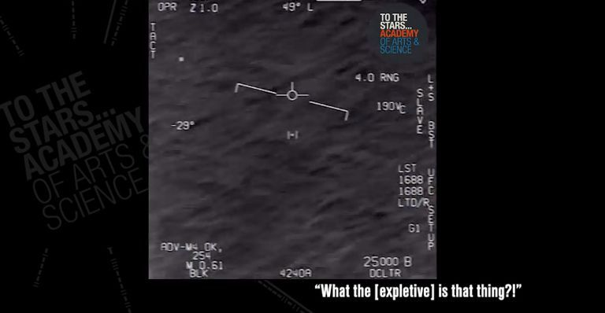

Joseph Gradisher, rzecznik zastępcy Szefa Operacji Morskich ds. Wojny informacyjnej, potwierdził, że niedawno opublikowane nieoficjalnie trzy nagrania, na których widać obiekty UAP są prawdziwe.

===

Nagrania zostały opublikowane przez To The Stars Academy. Rzecznik potwiedził, że zdaniem marynarki na trzech klipach wideo, widać "niezydentyfikowane fenomeny powietrzne.

Źródła:
* [time.com](https://time.com/5680192/navy-confirms-ufo-videos-real/)
* [popularmechanics.com](https://www.popularmechanics.com/military/a29073804/navy-ufo-videos-real/)
* [youtube.com/cnn](https://www.youtube.com/watch?v=oqOarhj6fFI)

